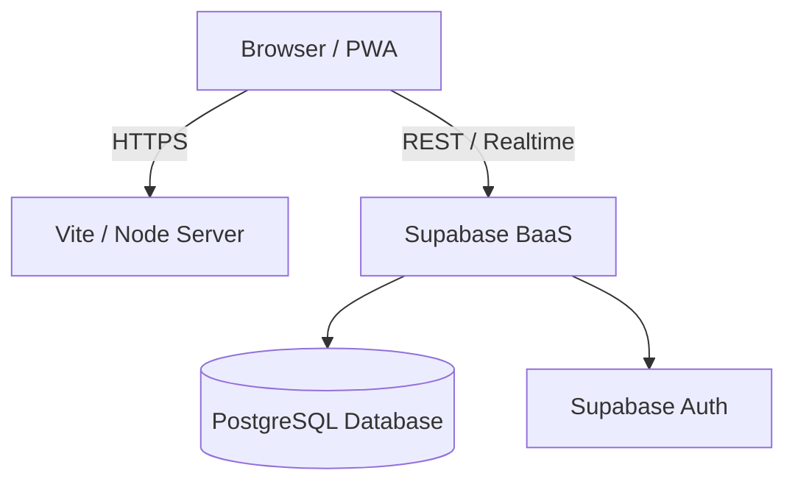

# System Architecture: DialXprt

## 1. High-Level Architecture Overview
DialXprt is designed as a modern, decoupled Single Page Application (SPA) with a lightweight server component for production builds. 
The architecture follows a client-heavy, server-light model, relying on Supabase for Backend-as-a-Service (BaaS) capabilities including authentication, database, and edge functions.



## 2. Technology Stack
### 2.1 Frontend layer
- **Framework:** React 18
- **Build Tool:** Vite (for fast HMR and optimized production bundling)
- **Language:** TypeScript (strict type checking enabled)
- **Styling:** Tailwind CSS (utility-first, configured via `tailwind.config.js`)
- **Icons:** `lucide-react` for lightweight, scalable vector icons.
- **Routing:** Conditional rendering based on state (`activeTab`, `selectedCategory`) optimized for a cohesive mobile-first SPA experience.

### 2.2 Backend & Data Layer
- **Database:** Supabase (managed PostgreSQL)
- **Authentication:** Managed by Supabase Auth
- **Production Server:** A custom Node.js entry point (`server.ts`/`server.cjs`) bundled via `esbuild`. 
- **Mock Data Layer:** Extensive localized mock datasets (`src/data/mockVendors.ts`) used for rapid UI development and testing before full DB integration.

## 3. Directory Structure
```text
dialxprt/
├── src/
│   ├── components/         # React UI Components
│   │   ├── AccountView.tsx # User/Vendor dashboard logic
│   │   ├── Header.tsx      # Sticky navigation & user controls
│   │   ├── SearchBar.tsx   # Complex filtering & auto-complete
│   │   └── ...
│   ├── data/               # Static/Mock data repositories
│   │   └── mockVendors.ts  # Vendor, category, and neighborhood seed data
│   ├── lib/                # Shared utilities and services
│   │   ├── supabase.ts     # Supabase client initialization
│   │   └── translations.ts # i18n logic (English, Telugu, Hindi)
│   ├── types.ts            # Global TypeScript interfaces
│   ├── App.tsx             # Main application orchestrator
│   └── main.tsx            # React DOM entry point
├── dist/                   # Compiled production build
├── vite.config.ts          # Vite configuration
├── tailwind.config.js      # Theme & styling configuration
└── tsconfig.json           # TypeScript strict compiler options
```

## 4. Core System Components

### 4.1 State Management
The application currently handles state heavily at the top level (`App.tsx`) using React hooks (`useState`, `useEffect`, `useMemo`).
- **Orchestration:** `App.tsx` controls global variables like `activeTab`, `searchQuery`, `currentNeighborhood`, and `currentLang`.
- **Filtering Logic:** Search filtering is computationally optimized using `useMemo` to sort vendors by relevance, distance, and rating without blocking the main thread.

### 4.2 Multi-language Support (i18n)
Instead of a heavy external library, the app uses a custom, lightweight translation dictionary located in `src/lib/translations.ts`. It maps English keys to localized strings (Telugu, Hindi) and re-renders components reactively when the language state changes.

### 4.3 UI Modularity
The UI is strictly broken down into modular components:
- **Presentation Components:** Buttons, Grids, Layouts (e.g., `CategoryGrid.tsx`).
- **Feature Components:** Search interactions, Registration forms (e.g., `VendorRegistrationView.tsx`).
- **Feedback Components:** Modals and Toasts (e.g., `AuthModal.tsx`, `NotificationToast.tsx`).

## 5. Build & Deployment Pipeline
1. **Development:** `npm run dev` starts the Vite dev server with hot-module replacement.
2. **Linting:** `npm run lint` enforces strict TypeScript compilation (`tsc --noEmit`).
3. **Production Build:** `npm run build` executes Vite to compile static assets, and subsequently runs `esbuild` to compile the Node server script (`server.ts` to `dist/server.cjs`).
4. **Deployment:** The `dist` folder is fully self-contained and ready to be deployed to any Node.js hosting platform (Vercel, Render, AWS, etc.).

## 6. Security Considerations
- **Environment Variables:** Secrets (Supabase URL, Anon Key) are managed strictly via `.env` files and exposed to Vite via `import.meta.env`.
- **Client-Side Validation:** All forms (Vendor Registration, Auth) implement strict local validation before attempting network requests.
- **Row Level Security (RLS):** Supabase database tables are expected to have RLS enabled, ensuring vendors can only edit their own profiles and customers can only view public profiles.
